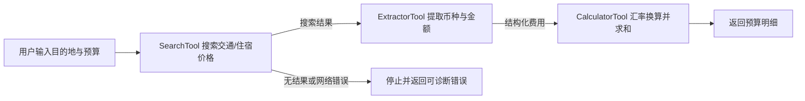
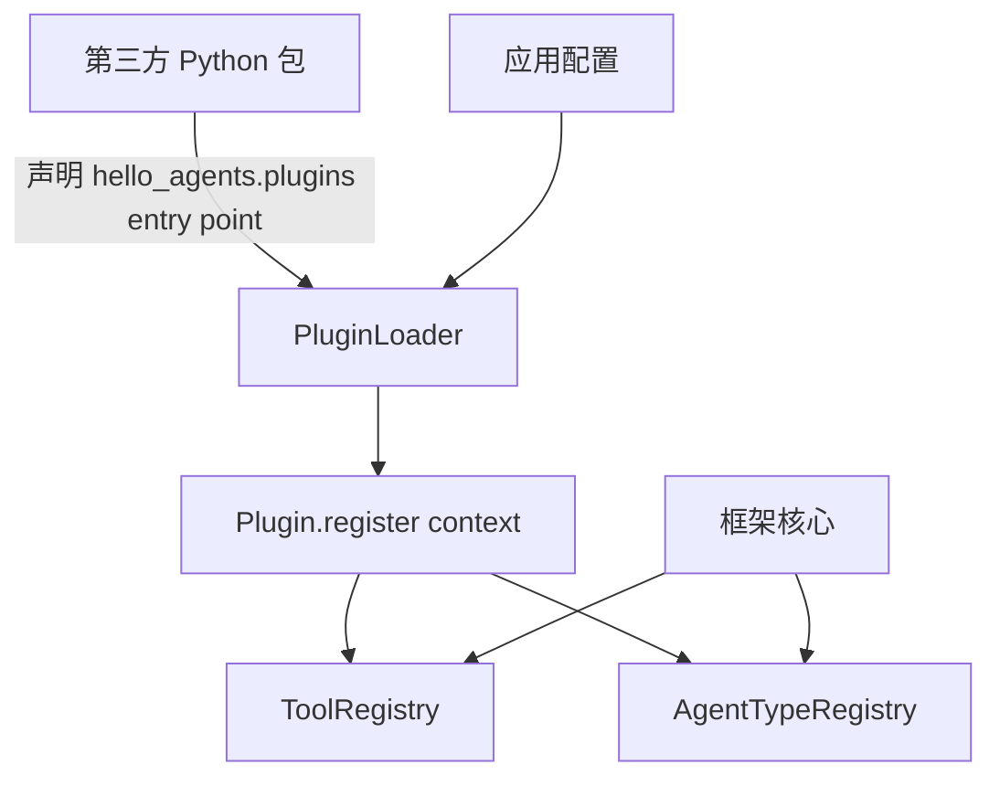

> [hello-agents 第七章 构建你的 Agent 框架](https://hello-agents.datawhale.cc/#/./chapter7/%E7%AC%AC%E4%B8%83%E7%AB%A0%20%E6%9E%84%E5%BB%BA%E4%BD%A0%E7%9A%84Agent%E6%A1%86%E6%9E%B6)

## 1. 运行

```sh
uv run python task2/main.py
uv run python task2/test_simple_agent.py
uv run python task2/test_exercises.py
uv run python task2/test_exercises.py --real
```

`task2/.env` 保存真实凭据，不提交仓库。自定义供应商支持如下。

- `WC_API_KEY`、`WC_BASE_URL`、`WC_MODEL_NAME`
- `GEMINI_API_KEY`，可选 `GEMINI_BASE_URL`、`GEMINI_MODEL`

## 2. 习题

### 2.1 自建框架的取舍

#### 主流框架的四个局限

1. **过度抽象**：成熟框架把一次模型调用拆成 chain、runnable、callback、memory 等对象；排错需要跨层追踪。
2. **快速迭代导致不稳定**：依赖升级可能改变构造参数、消息格式或工具协议，业务代码随之迁移。
3. **黑盒化**：框架替开发者决定提示词拼装、重试和工具调度后，错误很难定位。

#### “万物皆为工具”

优势：统一注册、描述、校验和调用协议；Agent 不必分别理解 Memory、RAG、MCP；新能力只需注册到 `ToolRegistry`。例如 RAG 可接受 query 并返回检索片段，Agent 将其视作普通 observation。

局限：并非所有能力都是无状态函数。Memory 涉及生命周期和一致性，MCP 涉及连接与权限，RAG 可能返回带来源和分数的结构化结果。强压成 `str -> str` 会丢失类型、事务和流式语义。简单查询适合工具抽象；会话状态、长期任务和资源管理应保留独立对象，仅把可调用入口暴露成工具。

#### 框架化改进与设计原则

第四章每种 Agent 各自管理 LLM、历史和工具；本章统一了 `HelloAgentsLLM`、`Message`、`Agent`、`ToolRegistry`，因此供应商切换、历史接口和工具发现可以复用。`Config` 集中默认值，异常类型统一边界，构造参数提供最大步数和提示词替换点。

优先原则：最小稳定接口、显式数据流、依赖倒置、可观测性、安全边界以及兼容标准 API。扩展点必须来自当前需求；不为未知未来提前加抽象。

### 2.2 LLM 供应商与本地推理

#### 新供应商

[`core/my_llm.py`](../core/my_llm.py) 的 `MyLLM` 通过继承增加 Gemini：`provider="gemini"` 读取 `GEMINI_API_KEY`，使用 Gemini 的 OpenAI 兼容端点；子类把自身默认的 `"auto"` 先转换为真实检测结果，并重写 `_auto_detect_provider()` 识别该变量。这里不能依赖父类自动识别：父类检测表没有 Gemini，而且已安装库的 `provider` 默认值是 `None`，若直接显式传入字符串 `"auto"`，会因 `provider or ...` 的真值短路跳过自动检测。

#### 自动检测冲突

同时设置 `OPENAI_API_KEY` 和 `LLM_BASE_URL="http://localhost:11434/v1"` 时，已安装库的 `HelloAgentsLLM._auto_detect_provider()` 最先命中 `OPENAI_API_KEY`，因此选择 `openai`；随后 OpenAI 分支仍采用 `LLM_BASE_URL`，最终形成 `provider=openai`、`base_url=http://localhost:11434/v1`、默认模型 `gpt-3.5-turbo` 的矛盾组合，实际请求发往 Ollama。

这不合理：provider 标签、默认模型与真实服务不一致。更安全的顺序是“显式 `provider` 参数 > 显式/统一 `base_url` 的特征 > 专用 key > key 格式 > 默认值”，冲突时至少告警。

#### vLLM、SGLang、Ollama 对比

| 维度     | vLLM                                                         | SGLang                                                                    | Ollama                                                                |
| -------- | ------------------------------------------------------------ | ------------------------------------------------------------------------- | --------------------------------------------------------------------- |
| 易用性   | 需要 Python/CUDA 环境和服务参数；OpenAI API 兼容             | 部署复杂度接近 vLLM；Python API 与 OpenAI/Ollama 兼容                     | 最简单，模型下载、量化格式和本地服务一体化                            |
| 资源占用 | 面向 GPU 高利用率，PagedAttention、连续批处理；服务本身较重  | RadixAttention 复用共享前缀，复杂多轮/树状请求更省 KV cache；服务本身较重 | GGUF/量化与 CPU、消费级 GPU 友好，默认吞吐换易用性                    |
| 推理速度 | 高并发通用服务的成熟基线，吞吐高                             | 前缀复用、结构化生成和 Agent 工作负载有优势；具体胜负依模型和负载         | 单用户本地体验足够，高并发通常弱于前两者                              |
| 推理精度 | 同模型、权重、量化和采样参数下，执行引擎原则上不改变模型能力 | 同左；激进量化或推测解码可能使输出不完全一致                              | 常用 GGUF 量化可能比 BF16/FP16 节省资源，但量化等级越低越可能损失质量 |

个人开发选 Ollama；通用 GPU API 服务优先 vLLM；共享前缀多、结构化输出或 Agent 工作负载应实测 SGLang。不能脱离模型、精度、并发和提示长度宣布固定速度排名。

> - [SGLang 官方文档](https://docs.sglang.io/)
> - [SGLang GitHub](https://github.com/sgl-project/sglang)
> - [vLLM 文档](https://docs.vllm.ai/)
> - [Ollama 文档](https://docs.ollama.com/)

### 2.3 核心类设计

#### Message 与 Pydantic

`Message` 用 `Literal` 限定角色，构造时验证类型，序列化行为稳定，错误能在进入 LLM API 前暴露；`metadata` 允许携带追踪信息，`to_dict()` 隔离内部字段与 OpenAI 消息格式。

#### Agent 的模板方法

题面描述的“公开 `run()` 固定流程、抽象 `_execute()` 提供变化点”属于**模板方法模式**：公共逻辑只写一次，子类只实现差异，调用方统一使用 `run()`。

#### Config 与单例

单例保证进程内只有一个实例，适合需要统一、可变且昂贵初始化的配置源；否则不同模块可能读到不同配置或重复加载资源。但不可变配置通过依赖注入通常更安全、更容易测试，单例会引入全局状态和测试污染。

### 2.4 四种 Agent 范式

#### ReAct 的三个框架化改进

1. `ToolRegistry.get_tools_description()` 自动生成工具说明并统一执行；第四章 `ToolExecutor` 与提示词手工耦合。新增工具无需改 Agent。
2. 继承 `Agent` 后复用 `Message`、`add_message()`、`get_history()` 与 LLM 接口；第四章只保存当前运行的字符串 observation，无法统一管理多轮历史。
3. `max_steps`、`custom_prompt`、`Config` 都由构造参数注入；第四章模板和行为更偏模块级硬编码。配置和领域提示词可替换而不复制循环。

解析协议仍依赖正则，并未因框架化自动变鲁棒；生产代码应优先使用模型原生 tool calling 或结构化输出。

#### 质量评分 ReflectionAgent

[`agents/scored_reflection_agent.py`](../agents/scored_reflection_agent.py) 继承 `ReflectionAgent`。每轮用结构化 JSON 获取 `score` 和 `feedback`：

- `score >= score_threshold`：立即结束；
- 否则根据反馈优化，再进入下一轮；
- 阈值限定为 0–100；先用 `json.loads()`，模型在反馈中生成 `\d`、`\s` 等非法 JSON 转义时，退回正则只提取 0–100 的分数，反馈保留原文。

#### Tree-of-Thought Agent

[`agents/tree_of_thought_agent.py`](../agents/tree_of_thought_agent.py) 继承 `Agent`。每层：

1. 生成恰好 `beam_width` 条候选；
2. 让 LLM 返回最优候选索引；
3. 把胜出思路追加到路径；
4. 重复 `max_depth` 层后，基于完整路径生成最终答案。

这是最小可运行的单路径 ToT；没有保留多条 beam，因为题目只要求“生成多个并选择最优路径继续”。候选或选择响应若不是合法 JSON，会携带格式纠正提示重试一次；连续两次失败才报错。完整 beam search 只有在单次贪心选择质量不足时再加。

### 2.5 工具系统

#### 统一接口与结构化返回

统一接口让注册表能无条件完成发现、描述、参数验证和执行，Agent 主循环不依赖工具实现。多值结果不应靠位置元组或拼接文本；定义稳定 schema，例如：

```json
{ "results": [{ "title": "...", "summary": "...", "url": "..." }] }
```

当前 `Tool.run()` 标注返回 `str`，最兼容的做法是返回上述 JSON 字符串；框架升级后可将返回类型改为 Pydantic 模型，并只在回灌 LLM 时序列化。

#### 三工具应用场景

旅行预算助手：先搜索目的地价格，再从结果提取金额，最后换算汇率并汇总预算。



三个步骤有数据依赖，必须通过 `ToolChain` 顺序执行，不应并行。

#### 线程池何时有收益

适合彼此独立、I/O 密集的工具，单次等待要远大于线程调度开销，例如并行搜索多个数据源、调用多个 HTTP API、读取独立文件。CPU 密集 Python 代码受 GIL 限制；有前后依赖的工具链、共享非线程安全客户端、任务极短或并发触发限流时不会获益，甚至更慢。实际 `AsyncToolExecutor.execute_tools_parallel()` 返回 `list[dict]`，并保留 task id、状态和错误，而不是单纯结果字符串。

### 2.6 扩展设计

#### 流式输出

现有原语已经足够：`HelloAgentsLLM.think()` / `stream_invoke()` 产出 `Iterator[str]`，`MySimpleAgent.stream_run()` 已转发 chunk。最小统一方案如下。

1. `Agent` 增加默认 `stream_run()`，简单实现可逐块 yield；
2. 各 Agent 在模型生成阶段调用 `stream_invoke()`，边收集完整文本边 yield `StreamEvent(type, data)`；
3. 工具 Agent 还需发出 `tool_start`、`tool_result`、`final` 事件，避免把中间工具协议当最终文本；
4. 流结束后一次性写入完整 assistant `Message`。

不要让 `run()` 和 `stream_run()` 各自复制业务循环；内部保留一条事件流，`run()` 消费并返回最终事件。

#### 多轮、分支与回溯

新增一个 `Conversation` 即可，不需要数据库抽象：保存 `messages: dict[id, MessageNode]`、`head_id`，节点含 `message`、`parent_id`。`append()` 接到当前 head；`fork(message_id)` 切换 head 后产生新分支；`checkout(message_id)` 回溯；`history()` 沿 parent 链重建上下文。

`Message.metadata` 保存 `message_id`、`parent_id`、`branch_id`；Agent 从 `Conversation.history()` 构造模型消息，不再直接拥有唯一线性的 `_history`。持久化需求出现后再给 `Conversation` 加存储适配器。

#### 插件系统

使用 Python 标准库 `importlib.metadata.entry_points()`，不自造扫描协议：



关键接口：

```python
class Plugin:
    def register(self, context: PluginContext) -> None: ...

@dataclass
class PluginContext:
    tools: ToolRegistry
    agent_types: dict[str, type[Agent]]
```

加载器只负责读取 entry point、实例化并调用 `register()`；注册表负责重名拒绝和类型校验。插件依赖、版本兼容、隔离和权限应由包管理及部署策略处理；当前课程规模不需要热加载或自定义生命周期容器。

## 3. 实践题自检覆盖

`task2/test_exercises.py` 使用确定性的 `FakeLLM` 验证：

- 高分初稿只调用“生成 + 评分”，不执行优化；
- 低分初稿优化一次，并在达到阈值后停止；
- ToT 每层生成指定数量候选，采用模型选择的路径，最后写入两条历史消息。
- ToT 收到脏 JSON 时纠正格式并重试一次。

真实模型验证：

```sh
uv run python task2/test_exercises.py --real
```

首次验证时，评分反馈中的非法转义触发过 `JSONDecodeError`，因此加入“标准 JSON 解析失败后仅提取分数”的兜底。修复后的实测输出：

```text
REFLECTION_SCORE [95]
TOT_PATH ['假设鸡有x只，兔有y只，根据题意列出方程组……']
TOT_ANSWER 鸡1只，兔1只。
```
