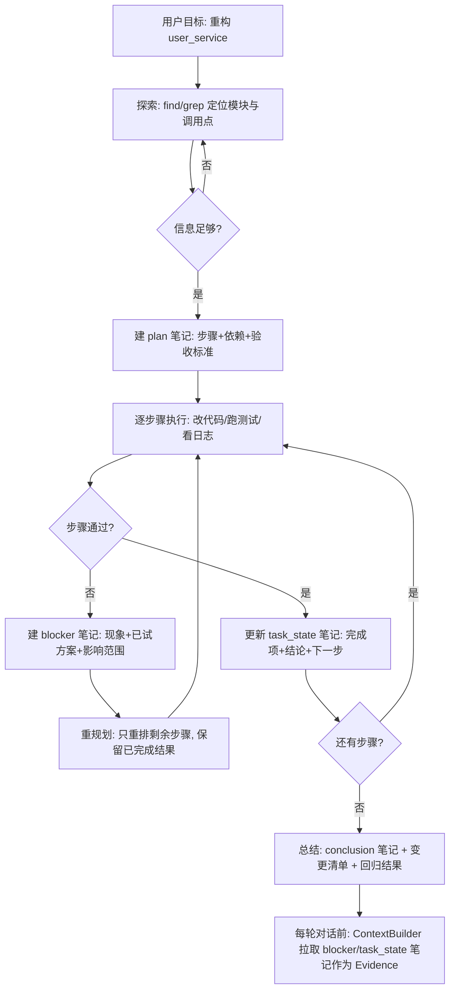

> [hello-agents 第九章 上下文工程](https://hello-agents.datawhale.cc/#/./chapter9/%E7%AC%AC%E4%B9%9D%E7%AB%A0%20%E4%B8%8A%E4%B8%8B%E6%96%87%E5%B7%A5%E7%A8%8B)

本章为框架补上"上下文工程"这一层：`ContextBuilder`（GSSC 流水线）、`NoteTool`（结构化笔记）、`TerminalTool`（JIT 文件系统访问），并以"代码库维护助手"收尾，把三者拼成长时程智能体。

本目录做了两件事。

- [`main.py`](./main.py)：把章节 9.3–9.6 的示例代码在本机 `hello-agents 0.2.9` 上真实跑一遍，记录**行为与章节描述的差异**；
- [`exercise.py`](./exercise.py)：实现章节习题里明确要求"动手实践"的四项（上下文质量评估、混合压缩、笔记自动整理、断点续传 + 任务依赖）。

`NoteTool` / `TerminalTool` 可用但有坑（笔记 ID 撞号会静默覆盖、终端沙箱可被绕过）；`ContextBuilder` 在中文查询 + 默认配置下会**静默丢掉全部检索信息**，`type="note"` 的上下文包永远不会进入最终模板。章节 9.6 的笔记注入链路在 0.2.9 上是断的（§3.2–§3.4）。

## 1. 运行

### 1.1 环境

| 项目         | 实测值             |
| ------------ | ------------------ |
| Python       | 3.14.0（`uv run`） |
| hello-agents | **0.2.8**          |
| tiktoken     | 0.14.0             |

### 1.2 环境变量

`task4/.env`（被 `.gitignore` 的 `.env` 规则忽略，含真实密钥，不要提交），直接复制 `task3/.env`：

```
LLM_API_KEY=xxx
LLM_BASE_URL=https://xxx
LLM_MODEL_ID=xxx
```

### 1.3 命令

```sh
uv run python task4/main.py       # 章节示例实测（GSSC / NoteTool / TerminalTool / 长程闭环）
uv run python task4/exercise.py   # 习题动手题（质量评估 / 混合压缩 / 笔记整理 / 断点续传）
```

两个脚本都会先清空 `task4/sandbox/`，可重复执行、输出稳定。`sandbox/` 是运行时产物（笔记、代码文件），不需要提交。

### 1.4 实测输出（节选）

GSSC 流水线（`main.py` §1）：

```text
-- 1.1 相关性打分：中文查询没有空格，split() 只能切出一个 token --
   relevance=0.00  type=knowledge_base  Pandas 内存优化：用 category 代替 object 可
   relevance=0.00  type=note            [笔记:第一阶段] 已完成数据模型层重构，测试覆盖率 85%

-- 1.2 min_relevance=0.3（默认量级）：检索到的信息被全部过滤 --
[Role & Policies]
你是数据工程顾问

[Task]
用户问题：如何优化Pandas的内存占用?

[Output]
                            请按以下格式回答：
                            1. 结论（简洁明确）
                            2. 依据（列出支撑证据及来源）
                            3. 风险与假设（如有）
                            4. 下一步行动建议（如适用）

-- 1.4 压缩阶段：超预算时按行截断，结构可能被截掉 --
⚠️ 上下文超预算 (278 > 180)，执行截断
[Role & Policies]
你是顾问
...
知识行 43：这是第 43 条检索到的资料
   [截断后是否还有 [Output] 分区] False

-- 1.5 记忆接入：ContextBuilder 调用的 memory_tool.execute() 在 0.2.9 不存在 --
   MemoryTool 有 execute 属性？ False
⚠️ 记忆检索失败: 'MemoryTool' object has no attribute 'execute'
```

NoteTool（`main.py` §2）：

```text
-- 2.1 缺陷：ID 由 len(index) 生成，删除后再建会撞号并静默覆盖文件 --
   ✅ 笔记已删除: note_20260922_141347_0
   新建 C 的 ID=note_20260922_141347_1，与已存在的 B(note_20260922_141347_1) 相同？ True
   索引里同 ID 出现次数: 2
   搜索原笔记内容 '依赖' 是否还能命中: False
```

TerminalTool（`main.py` §3）：

```text
-- 3.2 cd 越界：被拦（唯一做了路径校验的分支） --
❌ 不允许访问工作目录外的路径: /Users/jokerwon/workspace/jokerwon/hello-agents
❌ 不允许访问工作目录外的路径: /private/etc

-- 3.3 工作目录外读取：白名单只校验首 token，沙箱形同虚设 --
##
# Host Database
#
   ##

-- 3.4 白名单只看第一个词：&& / 管道直接放行 --
app.py
notes
PWNED-白名单只看第一个词
   app.py
notes

-- 3.5 白名单含 bash/python/node/cmd：任意命令执行 --
沙箱已逃逸: /Users/jokerwon/workspace/jokerwon/hello-agents/task4/sandbox
已写入沙箱外的 /tmp/task4_escape.txt

-- 3.6 危险命令本身被拦（但可被 3.5 绕过） --
❌ 不允许的命令: rm
```

长程闭环（`main.py` §4，真实 LLM）：

```text
-- 4.1 章节写法在 0.2.9 上直接报错：参数名已改为 additional_packets --
   TypeError: ContextBuilder.build() got an unexpected keyword argument 'custom_packets'

-- 4.2 章节写法：llm.invoke(context) 传字符串 → 422 --
   HelloAgentsException: LLM调用失败: Error code: 422 - ... 'msg': 'Input should be a valid list'

-- 4.3 章节写法：笔记包 type='note' 被选中却不进任何分区（静默丢失） --
   笔记内容出现在上下文里？ False

-- 4.4 修正后：笔记标成 knowledge_base + min_relevance=0 + invoke(list) --
[Evidence]
事实与引用：

[终端输出:代码库结构]
./app.py

[笔记:阻塞：依赖冲突] pydantic 1.x/2.x 并存，阻塞业务逻辑层重构
```

习题实现（`exercise.py`）：

```text
习题 2.3 混合压缩：786 → 111 tokens，[Output] 保留
{"input_tokens": 786, "budget": 200, "llm_summarized": true, "truncated": false, "output_tokens": 111, "has_output_section": true}

习题 4.2 / 4.3 断点续传与任务依赖
   模拟崩溃：已执行 2 步；本次已执行: ['T1', 'T2']
   从笔记恢复的状态: {"T1": "done", "T2": "done", "T3": "pending", "T4": "pending"}
   回滚为 pending 的任务: ['T3']
   恢复后执行的步骤: ['T3', 'T4'] （已完成的 T1/T2 不重复执行）
   全流程执行顺序: ['T1', 'T2', 'T3', 'T4']
   ✅ 依赖顺序正确且断点续传无重复执行
```

## 2. 本章要点

### 2.1 上下文工程 vs 提示工程

提示工程回答"提示怎么写"，上下文工程回答"**这一次调用里，模型应该看到哪一组 tokens**"。系统指令、工具定义、MCP、外部数据和消息历史全都算。区别在时间尺度：提示是写一次调优一次，上下文是每轮推理前都要重新策划与维护的状态。核心动作是从持续扩张的"候选信息宇宙"里**甄别什么进入有限窗口**。

### 2.2 上下文腐蚀与注意力预算

- **上下文腐蚀（context rot）**：窗口内 token 越多，模型准确回忆其中信息的能力反而下降（needle-in-a-haystack 类基准）。是**性能梯度**而非悬崖：长上下文仍强，只是检索与长程推理精度下降。
- **成因**：Transformer 的 n² 两两注意力被"拉薄"；训练分布里短序列更常见，长上下文专门参数更少；位置编码插值扩展窗口会牺牲位置精度。
- **推论**：上下文是**有限资源且边际收益递减**，每多一个 token 都在花"注意力预算"。所以目标是"**用尽可能少但高信号密度的 tokens，最大化期望结果的概率**"。

### 2.3 有效上下文的解剖学

| 组件     | 要点                                                                                                    | 常见失败模式                                                                    |
| -------- | ------------------------------------------------------------------------------------------------------- | ------------------------------------------------------------------------------- |
| 系统提示 | 分区组织（`<background>` / `<instructions>` / 工具指引 / 输出描述），追求"最小必要信息集"（不等于最短） | 过度硬编码（提示里写 if-else 分支逻辑）／过于空泛（只有宏观目标，没有具体信号） |
| 工具     | 职责单一、低重叠、错误鲁棒、入参描述无歧义、返回 token 友好                                             | "臃肿工具集"：功能边界模糊，连人类工程师都说不准该用哪个                        |
| 示例     | 精选**多样且典型**的 few-shot，直接画像期望行为                                                         | 罗列所有边界条件，把提示撑爆                                                    |

### 2.4 JIT 检索、渐进式披露与混合策略

- **智能体 = 在循环中自主调用工具的 LLM**；工程趋势是从"推理前一次性 embedding 检索"转向 **JIT（及时）上下文**：只维护轻量引用（路径 / URL / 查询），运行时用工具按需取数，配合 `head`/`tail` 分析大数据。
- **渐进式披露**：每一步交互产生新上下文，反过来指导下一步决策（文件大小暗示复杂度、命名暗示用途、时间戳暗示相关性）。
- **代价**：运行时探索比预计算检索慢，且需要"有主见"的工具与启发式设计，否则智能体误用工具、追逐死胡同。
- **混合策略**：前置加载少量高价值上下文（README、目录树）+ 提供 `glob`/`grep` 原语按需深挖。

### 2.5 长时程任务的三种手段

| 手段                   | 机制                                                                                             | 适用                           |
| ---------------------- | ------------------------------------------------------------------------------------------------ | ------------------------------ |
| 压缩整合（Compaction） | 接近上限时高保真总结，用摘要重启新窗口；保留架构决策/未决缺陷/实现细节，丢弃重复工具输出         | 需要长对话连续性，上下文"接力" |
| 结构化笔记             | 以固定频率把关键信息写入**上下文外的持久存储**（TODO、NOTES.md、结论/依赖/阻塞索引），需要时拉回 | 有里程碑的迭代式开发与研究     |
| 子代理架构             | 主代理规划与综合，子代理在**干净窗口**里深挖，只回传 1–2k token 摘要                             | 复杂研究/分析，可并行探索      |

### 2.6 GSSC 流水线（章节 9.3）

章节的设计目标：**统一入口**（Gather-Select-Structure-Compress 抽象成可复用流水线）、**稳定形态**（固定分区骨架 `[Role & Policies]/[Task]/[State]/[Evidence]/[Context]/[Output]`）、**预算守护**（token 预算 + 兜底压缩）、**最小规则**（只用"相关性 + 新近性"，不引入来源/优先级分类）。

章节版四阶段：Gather 多源汇集（记忆/RAG/历史/自定义包，每个源 try-except 容错）→ Select（`0.7×相关性 + 0.3×新近性`，`min_relevance` 过滤，贪心填预算）→ Structure（按类型分组渲染分区）→ Compress（超限时分区截断，保结构）。

**0.2.9 的实际实现与本节的差异见 §3.1**：配置项、评分函数、压缩策略和参数名全都变了。

### 2.7 NoteTool（章节 9.4）

Markdown + YAML 前置元数据的文件式笔记：YAML 元数据机器可解析、正文人类可读、文件名即 ID，天然支持 Git。索引文件 `notes_index.json` 保存全部元数据用于快速检索。七个操作：`create / read / update / delete / list / search / summary`。笔记类型 `task_state / conclusion / blocker / action / reference / general`，其中 `blocker` 优先级最高。

定位差异：`MemoryTool` 管**对话式记忆**（工作/情景/语义），NoteTool 管**项目式任务状态**，轻量、可人工编辑、可版本控制。

### 2.8 TerminalTool（章节 9.5）

为 JIT 上下文提供"即时文件系统访问"，章节声称四层安全：**命令白名单**（只读命令集合）、**工作目录沙箱**（禁止访问工作目录外路径、禁止 `..` 逃逸）、**超时控制**、**输出大小限制**。

**实测只有 `cd` 与超时/输出限制是真的，白名单与沙箱都可以绕过，见 §3.8。**

### 2.9 9.6 长程智能体：三层架构

```
即时访问   TerminalTool  —— 代码库探索、日志分析（无索引、实时）
会话记忆   MemoryTool    —— 会话内事实（TTL、可检索）
持久笔记   NoteTool      —— 跨会话的任务状态/结论/阻塞（文件、可人工编辑）
             ↓ 统一由 ContextBuilder 组装
          [Role & Policies] [Task] [State] [Evidence] [Context] [Output]
```

章节的 `CodebaseMaintainer` 还带了模式化预处理（`explore/analyze/plan/auto`）与后处理（发现"问题/bug/阻塞"自动建 blocker 笔记，讨论"计划/下一步"自动建 action 笔记）。

## 3. 实测踩到的坑

### 3.1 ContextBuilder 的 API 与章节（0.2.8）不一致

| 章节写法                                                                              | 0.2.9 实际                                                                                                                                                                                                    |
| ------------------------------------------------------------------------------------- | ------------------------------------------------------------------------------------------------------------------------------------------------------------------------------------------------------------- |
| `ContextPacket(content, timestamp, token_count, relevance_score, metadata)`           | `ContextPacket(content, timestamp=now, metadata={}, token_count=0, relevance_score=0.0)`，**字段顺序不同**，位置传参会错位；`token_count=0` 时自动用 tiktoken 计算                                            |
| `build(..., custom_packets=[...])`                                                    | `build(..., additional_packets=[...])`，直接抛 `TypeError`（实测 §4.1）                                                                                                                                       |
| `ContextConfig(max_tokens=3000, min_relevance=0.1, recency_weight, relevance_weight)` | `ContextConfig(max_tokens=8000, reserve_ratio=0.15, min_relevance=0.3, enable_mmr, mmr_lambda, system_prompt_template, enable_compression)`，**没有 recency/relevance 权重**，`0.7/0.3` 硬编码在 `_select` 里 |
| `_count_tokens()` 中文 1 字 + 英文 1.3 词                                             | `tiktoken cl100k_base`，且 `count_tokens` **未从 `hello_agents.context` 导出**，要 `from hello_agents.context.builder import count_tokens`                                                                    |
| `_compress(context, max_tokens)` 分区压缩 + `_truncate_text`                          | `_compress(context)` 只按行截断                                                                                                                                                                               |
| `[Output]` 是一句"请基于以上信息回答"                                                 | 固定四段式模板（结论/依据/风险/下一步），且**字符串里带源码缩进**，会污染提示词                                                                                                                               |

另有三个**声明了但从未被读取**的配置项（`grep` 全文件只有定义处）：`enable_mmr`、`mmr_lambda`、`system_prompt_template`，MMR 多样性和自定义系统提示模板在 0.2.9 里都没有实现。`hello_agents/context/__init__.py` 的文档字符串还宣传了 `Compactor` / `NotesManager` / `ContextObserver` 三个类，包内并不存在（只有 `builder.py`）。

### 3.2 中文查询相关性恒为 0 → 默认配置下检索信息全被过滤（最坑）

`_select` 用 `set(user_query.lower().split())` 做关键词重叠（`builder.py:210-217`）。中文没有空格，`split()` 只会切出**一个 token**：

```text
query  = "如何优化Pandas的内存占用?" → {"如何优化pandas的内存占用?"}
packet = "Pandas 内存优化：用 category 代替 object 可省 90% 内存" → {pandas, 内存优化：用, category, ...}
overlap = 0 → relevance = 0.00
```

于是 `min_relevance=0.3`（0.2.9 默认值）把**所有检索类信息包全部过滤**，最终上下文只剩 `[Role & Policies] / [Task] / [Output]`（实测 §1.2）。章节里的 `min_relevance=0.2` 同样过滤。危害在于**没有任何报错**：智能体"看起来正常工作"，只是永远看不到证据。

处置：中文场景把 `min_relevance` 设到 0（或 0.0x），并把相关性计算换成向量相似度（章节 9.3.5 的建议 2 是**必需项**）。

### 3.3 `type="note"` 的上下文包不进任何分区（9.6 的笔记注入静默丢失）

`_structure` 只渲染白名单内的类型：`instructions / task_state / related_memory / knowledge_base / retrieval / tool_result / history`（`builder.py:270-302`）。章节 9.6.3 的 `_notes_to_packets()` 把笔记包标成 `metadata={"type": "note", ...}`，**被选中、计入 token、然后被丢弃**（实测 §4.3：`笔记内容出现在上下文里？ False`）。

更麻烦的是章节想用 `relevance_score=0.9`（blocker）/`0.8`（action）给笔记排优先级，而 `_select` 会**无条件重算**所有包的相关性并覆盖该字段，这套"按笔记类型定权重"的设计在 0.2.9 上完全失效。

修正：把笔记包标成 `knowledge_base`（进 `[Evidence]`）或 `history`（进 `[Context]`），并接受相关性由关键词重叠决定。

### 3.4 记忆接入路径写死 `execute()` → ContextBuilder 永远拿不到记忆

`_gather` 调 `self.memory_tool.execute("search", ...)`（`builder.py:143`），而 0.2.9 的 `Tool` 基类只有 `run(parameters: dict)`，没有 `execute`：

```text
⚠️ 记忆检索失败: 'MemoryTool' object has no attribute 'execute'
```

异常被 `except` 吞掉（`builder.py:166-167`），表现为**记忆功能静默失效**：`[State]` 分区永远不会出现，`MemoryTool` 与 `ContextBuilder` 之间没有任何可用链路。章节 9.3.4 的 `ContextBuilder(memory_tool=..., rag_tool=...)` 示例因此只能给出"没有记忆"的上下文。

这是 **0.2.9 的功能性回归**：`execute` 在 `tools/base.py` 的 `Tool` 上不存在，`MemoryTool` / `RAGTool` 也都只定义 `run(parameters: Dict)`，所以 `builder.py:143` 与 `:156` 两处记忆检索**必然抛 `AttributeError`**。对照之下，RAG 分支（`builder.py:172`）用的是 `rag_tool.run({...})`，写法是对的，也就是说 0.2.9 里"记忆"这条支路整条是死的，"RAG"那条是活的（但受 §3.9 的嵌入不可用拖累）。

### 3.5 压缩按行截断会吃掉 `[Output]`

`_compress` 顺序保留行直到预算耗尽就 `break`（`builder.py:331-342`）。实测 `max_tokens=200`（可用 180）时输出在 `[Evidence]` 中途断掉，**`[Output]` 分区整个消失**（`截断后是否还有 [Output] 分区 = False`）。输出格式约束是最不该被截掉的部分。章节版的"分区压缩 + 保结构"没有实现。习题 2.3 的混合压缩就是针对这个缺陷写的（§4.2）。

### 3.6 NoteTool 的笔记 ID 由 `len(index)` 生成 → 删除后新建撞号并静默覆盖（数据丢失）

```python
def _generate_note_id(self) -> str:
    timestamp = datetime.now().strftime("%Y%m%d_%H%M%S")
    count = len(self.notes_index["notes"])   # note_tool.py:122
    return f"note_{timestamp}_{count}"
```

同一秒内：创建 A(_0)、B(_1) → 删除 A → `len=1` → 新建 C 得到 `_1`，与 B **同 ID**。实测结果（§1.4）：

```text
   新建 C 的 ID=note_20260922_141347_1，与已存在的 B(note_20260922_141347_1) 相同？ True
   索引里同 ID 出现次数: 2
   搜索原笔记内容 '依赖' 是否还能命中: False
```

`notes_index.json` 里留下两条同 ID 记录，B 的 `.md` 被 C 覆盖，原内容不可恢复且无任何警告。规避方式：**先建后删**（`exercise.py` 的 `organize_notes` 就是这么做的），或把 ID 改成 uuid/单调计数器。

### 3.7 索引只在构造时加载；`list` 默认静默截断 10 条

- `_load_index()` 只在 `__init__` 里调用，两个 `NoteTool` 实例共享同一 workspace 时，**后建实例看不到先前实例的写入，先建实例看不到后续写入**。实测 `exercise.py` 的笔记整理：整理函数内部用新实例操作，外部旧实例打印出来的还是整理前的 4 条 general 笔记，必须重建实例（或重读 `notes_index.json`）才能看到结果。
- `list` 默认 `limit=10`，12 条笔记时输出头部写"共 10 条"，**不提示还有 2 条**（`note_tool.py:224`）。要完整列举必须显式传 `limit`，但 `summary` 的计数是正确的，可用于交叉校验。
- 另外 `search` 是**子串匹配**（标题/正文/标签），无分词、无排序权重；章节 9.4.3 里 `search(note_type=..., tags=...)` 的过滤参数在 0.2.9 的 `run()` 分发里不存在，只有 `query` 和 `limit`。

### 3.8 TerminalTool 的沙箱与白名单都可以绕过

代码事实（`terminal_tool.py`）：白名单校验只看 `parts[0]`（第 149 行）；`_execute_command` 用 `shell=True`（第 218/228 行）；只有 `_handle_cd` 做了 `relative_to(workspace)` 路径校验（第 194-198 行）。实测：

| 尝试                                                | 结果                                                                                                  |
| --------------------------------------------------- | ----------------------------------------------------------------------------------------------------- |
| `cd ../../..` / `cd /etc`                           | ❌ 被拦（`不允许访问工作目录外的路径`）                                                               |
| `cat /etc/hosts` / `head -n 1 /etc/passwd`          | ✅ 成功读取工作目录外文件（单 token 命令，连 `bash` 都不需要）                                        |
| `ls && echo PWNED`                                  | ✅ 第二个命令照常执行，白名单只看第一个词，`&&` 之后的任意命令直接放行                                |
| `ls \| cat`                                         | ✅ 管道生效                                                                                           |
| `bash -c 'echo ...'`                                | ✅ 任意命令执行                                                                                       |
| `python3 -c "open('/tmp/task4_escape.txt','w')..."` | ✅ 在沙箱外写文件                                                                                     |
| `rm -f doomed.txt`                                  | ❌ 被拦（`rm` 不在白名单），但 `bash -c 'rm -f doomed.txt'` 返回"✅ 命令执行成功"，文件**确实被删除** |

三个叠加的根因：**白名单只校验 `shlex.split(command)[0]`**（第 149 行），`&&`、`|`、`;`、`$(...)` 全部绕过；**`_execute_command` 用 `shell=True` 执行原始字符串**（第 218/228 行），让上述元字符真正生效；**0.2.9 的白名单里加了 `python/python3/node/bash/sh/powershell/cmd`**（章节 §9.5.1 展示的集合里没有这些），等于白名单彻底失效。docstring 里的"限制在指定工作目录内"也只是 `cwd=`，**没有任何路径约束**，`head -n 1 /etc/passwd` 就是一个合法单 token 命令。给智能体接上这个工具，等于给它一个无限制的 shell。

### 3.9 嵌入的三级兜底全挂 → MemoryTool / RAGTool 不可用

本章只用 LLM 就能跑完，但顺带验证了 `hello_agents.memory.embedding`：

```text
dashscope FAIL RuntimeError Embedding REST 调用失败: 400 ... "Access denied ... overdue-payment"
local     FAIL TypeError LocalTransformerEmbedding.__init__() got an unexpected keyword argument 'api_key'
tfidf     FAIL TypeError TFIDFEmbedding.__init__() got an unexpected keyword argument 'model_name'
→ RuntimeError: 所有嵌入模型都不可用，请安装依赖或检查配置
```

两个独立问题：(1) 百炼账户欠费（task3 时还可用，属外部状态）；(2) `create_embedding_model_with_fallback` 把同一套 `kwargs`（`model_name/api_key/base_url`）透传给所有候选实现，而本地与 TF-IDF 实现不接受这些参数，`except: continue` 把 `TypeError` 当成"模型不可用"吞掉，**兜底链在设计上就无法兜底**。结果是 `MemoryTool(memory_types=["episodic"])` 直接构造失败；只有 `memory_types=["working"]` 可用。

### 3.10 LLM 与笔记检索的契约不符

- `llm.invoke()` 只接受消息列表，传字符串报 422（§1.4 / 4.2）。章节 9.6.3 的 `self.llm.invoke(context)` 与 9.4.4 的 `self.llm.invoke(context)` 都按字符串写的，直接跑必然失败。
- 章节 9.6.3 的 `_retrieve_relevant_notes()` 把 `note_tool.run({"action": "list"})` 的返回值当 `list[dict]` 用，而它返回的是**格式化字符串**。实测：

```text
list 返回类型: str | search 返回类型: str
9.6 _retrieve_relevant_notes 的写法报错: AttributeError 'str' object has no attribute 'get'
```

该异常被 `try/except` 捕获并打印 `[WARNING] 笔记检索失败: 'str' object has no attribute 'get'`，函数返回 `[]`，**笔记永远进不了上下文**，与 §3.3 叠加后，9.6 的"跨会话连贯性"在 0.2.9 上是完全断链的。

## 4. 习题

### 4.1 上下文腐蚀与 JIT（习题 1）

**（1）什么是上下文腐蚀？为什么 100K/200K 窗口仍要谨慎管理？**

见 §2.2。退化是**梯度**不是悬崖；窗口大 ≠ 免费，每 token 都在消耗注意力预算；长上下文下的**中间遗忘**（关键信息落在窗口中部时召回最差）使"把资料全塞进去"成为负收益策略。工程含义：预算要分配（系统指令/任务/证据/历史各有配额）、信息要按需检索、超限要压缩。

**（2）50 个文件的代码库：一次性加载 vs JIT**

| 维度       | 一次性全量加载                                                                | JIT（工具按需检索）                                |
| ---------- | ----------------------------------------------------------------------------- | -------------------------------------------------- |
| Token 成本 | 50 文件 × 数百行 ≈ 数十万 token，直接爆预算（即便窗口够，也触发 §2.2 的退化） | 每次只取命中片段，成本与问题规模相关而非库规模相关 |
| 时效性     | 快照即过时（改一行就得重建索引）                                              | 实时读取，永远最新                                 |
| 定位精度   | 噪声淹没信号：与问题无关的 49 个文件稀释注意力                                | `grep`/`find` 直接把范围收敛到相关文件             |
| 延迟       | 前置一次大加载                                                                | 多轮探索，累计延迟更高                             |
| 失败模式   | 关键信息被挤到窗口中部而漏读                                                  | 探索走错方向、漏掉关键文件（缺少引导时）           |
| 可解释性   | 引用整库，等于没有引用                                                        | 引用具体路径+行号，可核对                          |

选型：库小且问题高频固定（如只对 5 个核心文件提问）→ 一次性加载更省事；库大/频繁变更/定位式问题（"这个报错从哪来"）→ JIT。生产上通常是**混合**：常驻 README + 目录树 + 依赖清单（保证方向感），其余交给 `glob`/`grep`/`head` 按需拉取。这正是 9.2.2 的结论，也是本目录 `main.py` §3 里 TerminalTool 的用法，但要先修 §3.8 的沙箱问题。

**（3）系统提示的两个极端误区**

- **过度硬编码**：把业务分支写进提示，例如"如果用户问退款且订单金额>100 且超过 7 天，则回复 A；否则若……"。脆弱（规则一改就崩）、难维护、且占满注意力预算，还会与工具能力重复。
- **过于空泛**：只有"你是一个专业助手，请给出有帮助的回答"。模型不知道输出格式、不知道哪些信息可信、假设了错误的共享上下文（它不知道你的项目约定）。
- **平衡点**：写"**最小必要信息集**"，角色与边界、任务定义、可用工具及何时用、输出格式与验收标准，用 XML/Markdown 分区表达；先给最好的模型一个最小提示试跑，**按失败模式增补**具体指令与示例（失败是加信息的唯一依据，而不是想象边界条件）。

### 4.2 GSSC 流水线（习题 2）

**（1）某个阶段失效会怎样？**

| 失效阶段  | 表现                                                                                                                       | 危害等级           |
| --------- | -------------------------------------------------------------------------------------------------------------------------- | ------------------ |
| Gather    | 少源/取空（§3.4 的 `execute` 缺陷就是实例）：`[Evidence]` 为空，模型只能凭参数记忆作答 → 幻觉、无法引用                    | 高，且静默         |
| Select    | 选进无关信息或漏掉高相关信息：预算被噪声吃掉，注意力稀释，正确答案的召回率下降；`min_relevance` 设错会**整批丢弃**（§3.2） | 高，且静默         |
| Structure | 分区错位或类型不在白名单（§3.3）：信息在上下文里但模型不知道它是"证据"，引用混乱；`[Output]` 约束缺失导致格式漂移          | 中                 |
| Compress  | 过度压缩丢数字/约束/结构（§3.5 实测丢掉 `[Output]`）：结论漂移，且**看起来一切正常**                                       | 最高，因为最难发现 |

四种失效**都不报错**。所以评估（下一题）是必需的可观测性。

**（2）上下文质量评估（已实现：[`exercise.py`](./exercise.py) 的 `evaluate_context()`）**

```text
{
  "sections": ["Role & Policies", "Task", "Evidence", "Output"],
  "missing_sections": [],
  "total_tokens": 133,
  "density": 0.82,
  "duplicate_lines": 0,
  "relevance_mean": 0.0,
  "advice": ["检索信息相关性均值仅 0.00，考虑 MQE/HyDE 扩展查询或改用向量相关性"]
}
```

三个维度对应三种失效：**完整性**（必需分区是否齐全 → 抓 Compress 截断与 Structure 丢分区）、**信息密度**（去重后正文 token / 总 token，重复行数 → 抓 Gather/Select 的冗余与低质填充）、**相关性**（被选中的检索包均值 → 抓 Select 选错）。建议项按命中规则生成，可直接接到日志或 A/B 实验里。

局限（必须说清）：密度高不等于有用，相关性只是自评分；真正的地面真值是**任务成功率**。这套指标适合做回归告警（"这次构建的相关性均值从 0.6 掉到 0.0"），不适合当质量终点。

**（3）什么时候截断/滑窗比 LLM 摘要更合适？混合策略**

LLM 摘要的代价：一次额外 LLM 调用（延迟+成本）、输出不确定（不可复现）、**可能丢精确 token**（数字、ID、代码、路径和日志原文）。所以下列情况截断/滑窗更合适：

1. 预算极紧或延迟敏感（摘要本身可能超时/超预算）；
2. 内容高结构化，代码、表格、日志、JSON：摘要会破坏语法，截断反而保真；
3. 需要可复现（评测、回归、审计）；
4. 内容本身已是摘要或短片段；
5. 需要精确保留"最近 N 轮"（滑窗天然对齐对话语义，摘要会模糊时序）。

**混合策略**（已实现：`hybrid_compress()`，实测 786 → 111 tokens）：

```
① 结构保留：按分区优先级处理，Role/Task/Output 永不参与压缩
② 行级去重：相同行只留首次出现（廉价、无损）
③ 分区级压缩：低优先级分区（Evidence/Context）先用 LLM 摘要（保留数字与结论），
   摘要后仍超预算则整块丢弃
④ 截断兜底：按行填充，但**强制为 [Output] 预留空间**，尾部标注 [... 内容已截断 ...]
```

实测输出：`{"input_tokens": 786, "budget": 200, "llm_summarized": true, "truncated": false, "output_tokens": 111, "has_output_section": true}`。相比框架自带的按行截断（§3.5 丢掉 `[Output]`），同样预算下结构与输出约束都保住了。

### 4.3 NoteTool 与 TerminalTool（习题 3）

**（1）笔记自动整理机制（已实现：`organize_notes()`）**

```text
promoted: 随手记1 → blocker（命中"阻塞"）、随手记2 → action（命中"下一步"）、随手记3 → conclusion（命中"结论"）
merged:   随手记4 与 随手记1 内容指纹相同 → 删除
结果摘要: 总笔记数 3；blocker 1 / action 1 / conclusion 1，均带 auto_organized 标签
```

机制四步：**指纹去重**（`re.sub(r"\s+","",body)[:40]`，相同即冗余）→ **规则分类**（关键词表映射到 blocker/action/conclusion/task_state）→ **提升**（新类型 + 标签，便于回溯）→ **清理**（删除临时笔记）。两条工程约束来自实测：

- **先建后删**：NoteTool 的 ID 由 `len(index)` 生成（§3.6），先删后建会撞号覆盖，顺序反了就丢数据；
- **重建实例**：索引只在构造时加载（§3.7），整理后要用新实例（或重读 `notes_index.json`）才能看到结果。

局限：关键词规则脆弱（"没阻塞"会被判成 blocker），生产上应换成 LLM 分类 + 向量去重，并保留人工复核入口（笔记本来就是给人读的）。

**（2）当前安全机制够不够？如何设计人机协作审批？**

不够，实证见 §3.8：白名单可被 `bash -c` 绕过、工作目录外可读可写、`shell=True` 让所有 shell 元字符生效。**这是"防手滑"级别的护栏，不是安全边界。**

补强顺序（先堵能力，再加流程）：

1. **真正的沙箱**：容器/受限用户/只读挂载/网络隔离；把"能不能"交给 OS，而不是字符串匹配。
2. **去掉 `shell=True`**，改用 `subprocess.run(argv, shell=False)`，并对参数做解析（禁止绝对路径、`..`、重定向、`$()`）。
3. **能力分级**：`read`（ls/cat/grep/find）、`exec`（python/node/bash）、`write`（任何落盘操作）三档；`exec`/`write` 默认关闭，按任务临时授权。
4. **路径校验下推到每个命令**：所有参数中的路径 `resolve()` 后 `relative_to(workspace)`，不是只在 `cd` 里做。
5. **人机协作审批**（针对 write/网络/删除类）：Agent 提交结构化申请 `{command, 目的, 影响范围, 回滚方案, 过期时间}` → 人类 approve/deny → 审批结果与执行输出写入 NoteTool 笔记（可审计、可复盘）；**超时默认拒绝**；同一条命令的批准可缓存为限时策略以减少打断。
6. **审计与兜底**：全量命令日志、输出哈希、关键操作前自动快照（`git stash`/目录备份），保证可回滚。

**（3）智能代码重构助手工作流**



**笔记是状态载体，终端是取证手段，ContextBuilder 是装配层**。重构助手每轮只把"当前步骤 + 相关 blocker + 最近结论"装进上下文，代码本身永远现读现用（JIT），不做全库索引。

### 4.4 长时程任务管理（习题 4）

**（1）三层如何协调？什么信息放哪层？**

| 层               | 放什么                                            | 生命周期           | 检索方式         | 一致性策略                           |
| ---------------- | ------------------------------------------------- | ------------------ | ---------------- | ------------------------------------ |
| Terminal（即时） | 原始事实：文件内容、日志、目录结构、`git log`     | 单次读取           | 每次现读         | 无状态，**永远以磁盘为准**           |
| Memory（会话）   | 本轮对话中的临时事实与偏好（"用户正在用 Pandas"） | TTL / 会话结束即弃 | 向量/关键词      | 允许过期，过期不影响正确性           |
| Note（持久）     | 跨会话的结论、阻塞、任务状态、决策与理由          | 长期，人工可编辑   | 类型/标签/关键词 | 唯一事实源，**引用路径而非复制内容** |

协调规则三条：

1. **分层判据是"下次会话还需不需要"**，不是"重不重要"；需要 → Note，不需要 → Memory，随时能重算 → Terminal。
2. **单一事实源 + 引用**：笔记里写 `services/user_service.py:120 的重复逻辑`，不要把整段代码抄进笔记，复制是冗余与不一致的源头。
3. **一致性靠"重算优先"**：Terminal 的结果可以随时重取，因此**不要把它固化进笔记**；笔记只存"结论 + 出处"，需要细节时按出处重新取证。冲突时以 Terminal（磁盘真相）为准，并更新笔记。

**（2）断点续传（已实现：`CheckpointedTaskGraph`）**

机制：任务图 `{id: {depends_on, status, result}}` 序列化成 JSON，每次状态变更写一条 `task_state` 笔记（标题 `checkpoint: <project> @ <ts>`），恢复时取**最新**一条。

```text
模拟崩溃：已执行 2 步；本次已执行: ['T1', 'T2']
从笔记恢复的状态: {"T1": "done", "T2": "done", "T3": "pending", "T4": "pending"}
回滚为 pending 的任务: ['T3']
恢复后执行的步骤: ['T3', 'T4'] （已完成的 T1/T2 不重复执行）
全流程执行顺序: ['T1', 'T2', 'T3', 'T4']
```

**要记录什么状态**：任务图结构（依赖）、每个任务的 `status` + `result`（结果摘要，用于校验而不是重放）、执行序号、外部副作用清单（改了哪些文件）。

**如何校验恢复正确**：三条断言，(a) `running` 且**无 result** 的任务一律回滚为 `pending`（崩溃在任务中途，无证据表明完成；实测里 T3 就是这样被回滚的）；(b) 依赖满足性：任何 `done` 的任务其依赖必须全为 `done`，否则状态损坏，需人工介入；(c) 产物校验：`result` 中的路径/哈希与实际磁盘对比。

**注意**：回滚 `running` 会重放该步骤，所以每个步骤必须**幂等**（用 `task_id + 输入哈希` 作幂等键，或写操作先检查目标状态）。有不可逆副作用（发邮件、扣款）的步骤要单独走审批或补偿事务。

**（3）任务依赖管理（已实现：`ready_tasks()` + `run()`）**

调度器核心就一行：`ready = pending 且依赖全部 done 的任务`，循环取一个执行；每步完成即写检查点，因此**崩溃恢复与正常执行走同一条代码路径**（`run(state["tasks"])`）。扩展方向：

- **并行**：一次取整个 ready 集合，用线程/子代理并发执行（对应 §2.5 的子代理架构）；
- **失败传播**：任务失败时把其所有下游标 `blocked`（而非留在 pending 空转），只重规划受影响子图；
- **循环依赖检测**：入图时做拓扑排序，有环直接拒绝（否则 `ready_tasks` 永远为空，表现为"静默卡死"）；
- **与 NoteTool 集成**：每个任务一条笔记（`action` 类型），依赖写成 `depends_on: [note_id]`，任务状态变更即 `update` 笔记，这样人类可以直接在 Markdown 里改状态并让调度器读到。

### 4.5 渐进式披露（习题 5）

**（1）一个具体场景：复杂问题调试**

```
报错信息（10 行）            → 提炼关键词 "KeyError: 'user_id'"
  ↓ grep -rn "user_id" 定位  → 3 个候选文件，选最可疑的 services/user.py
  ↓ 读该函数（40 行）         → 发现用了 request.json["user_id"]
  ↓ 读上游调用点             → 上游传的是 "userId"（命名不一致）
  ↓ 修复 + 跑测试            → 通过
```

每一步的产物决定下一步的检索方向：报错文本 → 关键词 → 文件 → 函数 → 调用链。全程只把"当前必要子集"留在工作记忆里（合计约 200 行），而一次性加载 50 个文件既超预算又会让注意力被无关代码稀释。学术论文写作同理：先读摘要筛选文献 → 只精读入选文献的方法节 → 引用逐条收敛到最终结论，而不是把 40 篇 PDF 全塞进上下文。

**（2）探索引导机制**

- **预算**：给探索阶段独立的 token/步数预算（如"最多 8 次工具调用"），超限强制收敛到已有证据作答；
- **启发式优先级**：先读入口与约定类文件（README、`main.py`、配置文件和依赖清单），再按命名/目录/时间戳信号排序（`tests/test_x.py` vs `src/core/x.py` 语义不同，最近改动的文件更可能相关）；
- **信息增益估计**：每步后自问"当前假设是什么？这一步的结果能否区分两个假设？"，不能区分就换目标；
- **负缓存**：记录"已探索且无果"的路径，避免重复扫同一片区域；
- **元认知检查点**：每 N 步要求智能体用一句话写出"当前已知/未知/下一步"，把漂移暴露出来；
- **提前终止**：连续两步信息增益低于阈值就停止探索，直接给结论并标注不确定性。

**（3）渐进式披露 vs 一次性加载**

| 任务类型                         | 更优策略                         | 原因                                     |
| -------------------------------- | -------------------------------- | ---------------------------------------- |
| 排障：从报错定位到具体代码行     | 渐进式披露                       | 目标是收敛到一个小片段，全量加载是纯噪声 |
| 大型代码库的功能实现/重构        | 渐进式披露（+ 少量常驻约定文件） | 库大于窗口，且只需局部上下文即可动手     |
| 多源研究/文献综述                | 渐进式披露（子代理并行探索）     | 探索路径本身不确定，需要每步反馈调整方向 |
| 单份合同/短文档审阅（20 页以内） | 一次性加载                       | 需要跨条款一致性，切碎反而丢全局约束     |
| 跨文件重命名、接口影响面分析     | 一次性加载（或全量 + 全局检索）  | 需要"全局一致性"，局部视图会漏改调用点   |
| 结构化 diff / 变更审查           | 一次性加载                       | 输入本身已是最小充分集，探索无收益       |

判据：**输入规模远小于窗口、且任务需要全局一致性 → 一次性加载；输入远大于窗口、或相关性只能靠探索确定 → 渐进式披露**。

## 5. 文件

| 文件                           | 内容                                                                                                                           |
| ------------------------------ | ------------------------------------------------------------------------------------------------------------------------------ |
| [`main.py`](./main.py)         | 章节 9.3–9.6 示例实测：GSSC 四阶段行为、NoteTool 七操作与 ID 缺陷、TerminalTool 安全边界、长程助手最小闭环（真实 LLM 调用）    |
| [`exercise.py`](./exercise.py) | 习题动手题：`evaluate_context()`、`hybrid_compress()`、`organize_notes()`、`CheckpointedTaskGraph`（含断点续传与依赖调度断言） |
| `sandbox/`                     | 运行时产物（笔记、被探索的代码文件），可随时删除                                                                               |

两处刻意的简化（都标了升级路径）：`organize_notes()` 用关键词规则而非 LLM 分类；`hybrid_compress()` 的分区优先级表是硬编码的固定顺序。规模上来后分别换成 LLM 分类 + 向量去重、以及由任务类型驱动的优先级策略。

## 6. 参考

- [Anthropic. Effective Context Engineering for AI Agents](https://www.anthropic.com/engineering/effective-context-engineering-for-ai-agents)
- [David Kim. Context-Engineering (GitHub)](https://github.com/davidkimai/Context-Engineering)
