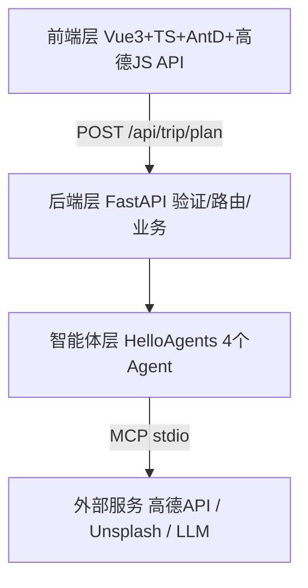

> [hello-agents 第十三章 智能旅行助手](https://hello-agents.datawhale.cc/#/./chapter13/%E7%AC%AC%E5%8D%81%E4%B8%89%E7%AB%A0%20%E6%99%BA%E8%83%BD%E6%97%85%E8%A1%8C%E5%8A%A9%E6%89%8B)

本书"实战篇"第一章：把前面 12 章的智能体范式、工具系统、MCP 协议、记忆机制拼成一个完整的全栈 Web 应用：Vue3+TS 前端、FastAPI 后端、4 个 SimpleAgent 协作、高德地图 MCP + Unsplash 图片 API，实现行程规划 / 地图可视化 / 预算计算 / 行程编辑 / 导出 PDF。

本目录做了两件事。

- [`main.py`](https://github.com/jokerwon/hello-agents/blob/main/task6/main.py)：把章节 13.2 / 13.3 / 13.6.1 的**可离线核心**在本机真实跑一遍：Pydantic 模型层次（含高德温度字符串验证器）、四 Agent 串行流水线（LLM 与高德 MCP 全部 mock）、预算确定性重算，**不依赖 LLM、不依赖外网、不需要任何 API Key**，可重复执行；
- 本 README：章节学习记录、实测、批判性差异清单与心得。

这一章的价值在**工程化路径**：数据模型自底向上（Pydantic 是前后端之间的契约）、复杂任务按"旅行社分工"拆成 4 个单一职责 Agent、外部能力用 MCP 而不是手写 HTTP 封装（一个 `MCPTool(auto_expand=True)` 换来 16 个工具 + 单进程共享）。章节也难得地诚实：进度条是假的、导出的地图 Canvas 问题没解决（导出时干脆隐藏地图）、预算靠 LLM 估算不可靠。这些"坑"本身就是实战的一部分。

## 1. 运行

### 1.1 环境

| 项目                  | 实测值             | 备注                                                      |
| --------------------- | ------------------ | --------------------------------------------------------- |
| Python                | 3.14.0（`uv run`） |                                                           |
| pydantic              | 2.13.5             | 经 `hello-agents 0.2.9` / `openai` 传递依赖引入，无需新装 |
| LLM / 高德 / Unsplash | 无                 | 全部 mock；真实项目需 `.env` 配三组 Key                   |

### 1.2 命令

```sh
uv run python task6/main.py
```

### 1.3 实测输出

```text
§1 数据模型：温度验证器 '22°C' -> 22 12
§1 范围验证生效: Input should be less than or equal to 90

§2 四 Agent 流水线（LLM/高德 MCP 均 mock）:
  Day1 2026-10-01: ['故宫博物院', '天坛公园'] 住:如家酒店(前门店)
  Day2 2026-10-02: ['颐和园'] 住:如家酒店(前门店)

§3 预算确定性重算:
  门票=105 酒店=300 餐饮=80 交通=200 总计=685

全部断言通过 ✅
```

覆盖与章节示例的对应关系见下表。

| main.py                                  | 章节            | 说明                                                                                                                                   |
| ---------------------------------------- | --------------- | -------------------------------------------------------------------------------------------------------------------------------------- |
| §1 模型层次 + `parse_temperature` 验证器 | 13.2.3 / 13.2.4 | 高德返回 `"16°C"` 脏字符串，`mode='before'` 验证器在入口一次洗干净；`Location` 经纬度用 `ge/le` 范围验证，非法值直接 `ValidationError` |
| §2 `TripPlannerAgent.plan_trip` 流水线   | 13.3.2 / 13.3.3 | 保留章节的 5 步骨架（景点→天气→酒店→整合→解析 JSON），把 SimpleAgent+LLM+MCPTool 换成返回固定 JSON 的 mock Agent，验证数据流转本身     |
| §3 `compute_budget`                      | 13.6.1          | 章节让 PlannerAgent 的提示词要求 LLM 输出 budget；这里改为从行程条目（门票/酒店晚数/餐饮）**确定性重算**，见 §4.3 的讨论               |

## 2. 章节学习记录

### 2.1 项目概述与架构（13.1）

四层前后端分离架构见下图。



数据流：表单 → HTTP → Pydantic 校验 → 4 Agent 依次执行 → 每个 Agent 经 MCP 调外部 API → 整合 → JSON 响应 → 前端渲染。快速体验需要三组 Key（LLM、高德 Web 服务、Unsplash Access），后端 `uvicorn app.api.main:app --reload`，前端 `npm run dev`（Vite，:5173）。

### 2.2 数据模型（13.2）

**字典原型撑不到生产**。三个痛点：字段名不统一（`lng`/`lon`/`longitude`，高德还返回 `"116.39,39.91"` 字符串）、类型不安全（`price` 变 `"60"` 要到算总账时才炸）、加字段要改 N 处。

解法是 Pydantic `BaseModel` + 自底向上组合：

```
Location ─┬─ Attraction ─┐
          ├─ Meal        ├─ DayPlan ─── TripPlan
          └─ Hotel ──────┘        └── WeatherInfo（field_validator 洗温度）
                        Budget ──────┘（Optional，LLM 可能不生成）
```

要点有这几条。

- `Field(..., ge=-180, le=180)`：约束写进模型，非法数据在边界就被拦下，而不是流到计算逻辑里；
- `@field_validator('day_temp', mode='before')`：外部 API 的脏格式在**模型入口**统一清洗 + `try/except` 容错兜底为 0，下游代码永远只见 `int`；
- `Optional` + `default_factory=list`：可选字段显式化，前端用 `v-if="tripPlan.budget"` 对应容错；
- FastAPI 直接拿模型当请求/响应类型：自动验证、自动序列化、自动 OpenAPI 文档三合一；
- 前端用同构 TypeScript `interface` 镜像每个模型（`?` 对应 `Optional`），前后端共享一份数据契约。

### 2.3 多智能体协作（13.3）

为什么不用单 Agent？章节给了三层递进的排除法：

1. **SimpleAgent**：每次 `run()` 只执行一个工具 → 要多次调用，中间结果得手动接力，状态管理爆炸；
2. **ReactAgent**：一次能调多个工具，但每轮思考一次 LLM 调用且**串行**，3 个工具 ≥3 轮，延迟不可接受；
3. **巨型提示词**：把所有任务逻辑塞一个 prompt → 难维护（改景点逻辑动全身）、易出错（LLM 混淆任务格式）、难调试（不知道坏在哪一环）。

于是按"旅行社分工"拆 4 个 Agent，每个都是 SimpleAgent + 极简提示词：

| Agent                 | 职责                           | 工具                    | 提示词复杂度                        |
| --------------------- | ------------------------------ | ----------------------- | ----------------------------------- |
| AttractionSearchAgent | 按偏好搜景点                   | `amap_maps_text_search` | 低：格式 + 示例 + "禁止编造"        |
| WeatherQueryAgent     | 查天气                         | `amap_maps_weather`     | 极低：一行                          |
| HotelAgent            | 按住宿类型搜酒店               | `amap_maps_text_search` | 低                                  |
| PlannerAgent          | 整合三路信息生成完整 JSON 计划 | **无工具**，纯 LLM      | 高：严格 JSON schema + 7 条规划要求 |

协作是**代码编排的固定流水线**（`plan_trip` 顺序调用），不是 Agent 间自主通信。前三个 Agent 的输出文本拼进 `_build_planner_query` 的 f-string 模板，交给 PlannerAgent。信息传递靠 Python 变量，不靠对话历史。

### 2.4 MCP 工具集成（13.4）

为什么不直接 `requests.get` 调高德 API？Agent 失去自主决策权（退化成硬编码函数调用）、十几个参数要塞进提示词、响应解析代码到处散落、十几个 API 手动注册管理混乱。

MCP 集成只有一段代码：

```python
mcp_tool = MCPTool(
    name="amap_mcp",
    command="npx",                          # 代码仓实际用 uvx（Python 生态），等价
    args=["-y", "@sugarforever/amap-mcp-server"],
    env={"AMAP_API_KEY": settings.amap_api_key},
    auto_expand=True,                       # 关键：1 个 MCPTool 展开成 16 个独立工具
)
```

调用链：Agent 生成 `[TOOL_CALL:amap_maps_text_search:keywords=景点,city=北京]` 标记 → HelloAgents 解析 → Tool 对象构造 JSON-RPC `tools/call` 经 **stdin** 写给 MCP 服务器进程 → 服务器调高德 HTTP API → 结果经 **stdout** 返回文本。对 Agent 而言只有一个"能搜景点的工具"，协议细节全被封装。

**共享实例**是工程亮点：3 个用地图的 Agent 共用同一个 `MCPTool`，只有一个服务器进程、统一走 API 限速、省内存。这正是 task5（第十章）`MCPTool` 封装在真实项目里的用法。

Unsplash 图片则**故意不做成 Tool**：在 API 路由里直接 `requests` 调用给景点补图。图片搜索不需要 Agent 智能决策，只是数据增强。工具化的边界判断：只有需要 LLM 决策"是否调、怎么调"的能力才值得包成 Tool。

### 2.5 前端与功能实现（13.5 / 13.6）

- **技术栈**：Vue3 Composition API + TypeScript + Vite + Ant Design Vue + 高德 JS API + html2canvas/jsPDF；
- **API 封装**：Axios 实例 `timeout: 120000`（多 Agent 串行 10-30s 是常态），请求/响应拦截器做日志，`generateTripPlan(request: TripPlanRequest): Promise<TripPlan>` 单一入口，类型签名全程受检；
- **进度条**：`setInterval` 每 500ms +10%、按区间切状态文案（搜景点→查天气→荐酒店→生成计划），封顶 90% 等真实响应。**纯模拟**，章节自己承认"无法准确知道后端进度"；
- **行程编辑**：进入编辑模式时 `JSON.parse(JSON.stringify(plan))` 深拷贝留底，取消即回滚；上移/下移用解构交换 `[a[i], a[j]] = [a[j], a[i]]`；删除用 `splice`；保存后重刷地图；
- **导出**：`html2canvas(scale: 2, useCORS: true)` 截 DOM → PNG / jsPDF（A4 宽 210mm 按 Canvas 宽高比算高）。**已知坑**：高德地图本身是 Canvas 渲染，html2canvas 处理嵌套 Canvas + 跨域失败，多种方案试过后最终降级为导出时隐藏地图只出文字。章节列了 4 条替代路线（静态地图 API / 地图与内容分开导出后端合并 / Puppeteer 服务端截图 / 简化导出内容），选了最保守的第 4 条；
- **侧边导航**：AntD Menu + 原生 `scrollIntoView({behavior:'smooth'})` 锚点跳转，零额外依赖。

## 3. 与真实运行的差异清单

| #   | 章节做法                                        | 本目录实测                        | 原因                                                  |
| --- | ----------------------------------------------- | --------------------------------- | ----------------------------------------------------- |
| 1   | 4 个 SimpleAgent 各配 LLM                       | mock Agent 返回固定 JSON          | 无 Key 离线可跑；验证的是流水线与模型，不是 LLM 本身  |
| 2   | `MCPTool(npx amap-mcp-server)` 16 工具          | 未启动真实 MCP 服务器             | 需高德 Key；MCPTool 机制已在 task5 §1-3 实测过        |
| 3   | PlannerAgent 提示词要求 LLM 输出 budget         | `compute_budget` 从条目确定性重算 | LLM 算术不可靠，见 §4.3                               |
| 4   | 模型带 `category/description/wind_*` 等完整字段 | 保留骨架、裁掉演示用不到的字段    | 冒烟测试只验证结构、验证器、嵌套组合                  |
| 5   | FastAPI + Vue 全栈                              | 无 Web 层                         | 章节 Web 部分是标准 CRUD + 组件用法，无智能体知识增量 |

## 4. 心得

### 4.1 多 Agent 的本质是"提示词的分治"，编排可以很无聊

这一章的 4-Agent 系统没有任何 A2A/ANP 协议、没有 Agent 间对话，就是 Python 顺序调用 + f-string 拼接查询。这恰恰是对的：**能确定流程就不要让 LLM 决定流程**。每个 Agent 的提示词从"巨型全能 prompt"缩到几行，换来的是可独立测试、可独立替换、坏了知道找谁。对比第七章的 ReactAgent：自主性是能力也是成本（每轮一次 LLM 调用 + 不可预测路径），固定流水线用 4 次确定性调用替代 N 轮思考，延迟和调试成本都更低。拆分的判据和微服务一样：**单一职责 + 提示词写不下就是该拆了**。

### 4.2 Pydantic 模型是全栈系统的"宪法"

数据要穿过 7 层（表单→HTTP→Python→外部 API→Python→HTTP→TS），每层格式都可能不一致。章节的答案是**一处定义、处处生效**：验证器把高德的 `"16°C"` 在边界洗成 `int`，`ge/le` 把非法坐标拦在门外，FastAPI 白拿验证+文档，TS interface 镜像同一契约。这和 task3/task4 记忆系统里"结构化优于自由文本"是同一个思想：**LLM 和外部 API 都不可靠，可靠性要靠类型系统钉死在边界上**。`field_validator(mode='before')` + try/except 兜底的组合值得抄进任何对接脏 API 的项目。

### 4.3 LLM 负责"选"，代码负责"算"

章节把预算交给 PlannerAgent 的提示词估算（"门票总费用就是 105 元"这种心算），这是全章最脆弱的一环：LLM 加法会错、会漏项、`total` 和分项对不上是常态。`main.py` 的 `compute_budget` 给出修正模式：**行程条目（门票/酒店价/餐标）已经是结构化数据，预算就该由代码确定性汇总**。推广开来，LLM 擅长从模糊需求里"选"景点、排顺序、写建议；凡是可计算、可校验的（预算、日期差、距离），一律代码接管。`TripPlan` 里 `budget: Optional` 也侧面印证作者知道 LLM 可能不生成它。

### 4.4 章节的诚实比完美更有教学价值

三处"没做好"的地方章节都直说了：进度条是假的（真做需要 SSE/WebSocket 推进度，成本换体验不一定值）；导出地图的嵌套 Canvas 问题试了多种方案后放弃，降级为隐藏地图；Unsplash 免费但不准，准确的要付费。这就是真实工程的常态：**在约束下选"够用的降级"，并把升级路径写清楚**（§13.6.4 列的 4 条替代方案）。比假装一切完美更能教会人做取舍。

### 4.5 工具化的边界：不是所有外部能力都该包成 Tool

Unsplash 直接在路由里 `requests` 调用，不进 Agent 工具链，因为"给景点补图"无需 LLM 决策，包成 Tool 只会白付一次推理成本和一层不确定性。**需要 LLM 决定"调不调、怎么调"的才配 Tool/MCP，纯数据增强就写普通函数**。这和 13.4.1 反对"直接调高德 API"并不矛盾：高德调用参数（关键词、城市、类型）需要 Agent 根据用户偏好智能选择，Unsplash 的 query 就是拼好的景点名。

### 4.6 待验证的问题（真实跑通项目时）

1. 4 Agent 串行的端到端延迟到底多少？章节说 10-30s。景点/天气/酒店三路**无依赖，完全可以并发**（`asyncio.gather`），是章节没做还是 SimpleAgent 同步接口所限？
2. PlannerAgent 一次要吞下三路原始输出 + 严格 JSON schema，长行程（7 天）会不会超上下文或 JSON 截断？`_parse_trip_plan` 对残缺 JSON 的容错策略值得细读源码；
3. `auto_expand` 的 16 个工具全量注入 3 个 Agent，还是各 Agent 只挂自己需要的子集？全量注入会稀释提示词注意力（第十章实测过工具列表进 system prompt）。
